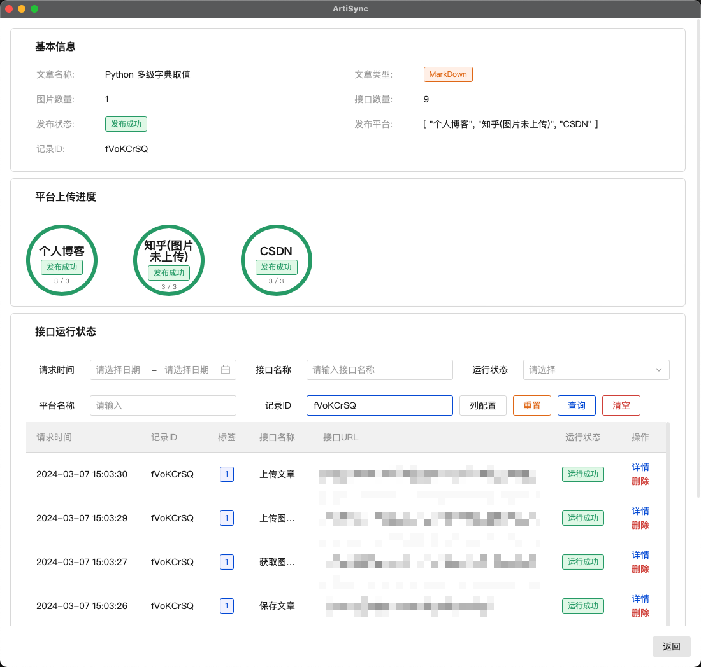

# README

## 简介

ArtiSync（多平台文章同步）是一个能批量将MarkDown文章，上传至各个平台的工具，主要解决多平台上传问题，以及不同平台的防盗链机制，导致文章图片存在三方网站时，该平台不能正确显示该文章图片的问题。本工具核心如下：

1. Markdown分析模块: 分析Markdown文章、提取文章中图片、替换文章中图片
   
2. 网络控制模块：自定义接口及返回、接口之间参数传递、批量更换接口字段
   
3. 文章控制模块：提供功能性接口，如加载文章、打开文件、运行接口等
   
4. 软件运行逻辑：加载一个或多个文章后，将按照每个平台中的接口列表依次执行里面的接口，以进行图片上传以及文章上传，达到一键分发多个平台的目的

文章发布流程如下：


## 通知
整了一个新项目，原理是用机器人打开浏览器上传：
好处是：

解决了自己挨个抓接口，测试接口，以及部分接口不好绕过的问题
可一键打开平台登录页以登录获取cookie，一键打开上传完后的平台页，方便登录和发布
坏处是：
1.新增平台需要在源代码上修改，增加go文件
2.部分平台可能有机器人检测，需要进行处理
新项目地址如下：[ArtiSync-Rod](https://github.com/Devil-Ryu/ArtiSync-Rod)

PS：后续会考虑把登录功能和打开发布页功能同步到该接口版本上，不过目前精力有限，若有刚需要求的，可从[ArtiSync-Rod](https://github.com/Devil-Ryu/ArtiSync-Rod)中把核心代码进行合并到此版本

## 上手指南

1. 根据操作系统安装[wails](https://wails.io/zh-Hans/docs/gettingstarted/installation/)

2. 克隆此仓库

```shell
git clone https://github.com/Devil-Ryu/ArtiSync.git
```

3. 运行项目
   
```shell
wails dev
```
4. 构建项目
   
```shell
wails build
```

本项目采用`wails`开发，逻辑使用GO语言，前端页面使用VUE3，前端模板采用TDesigner

## 使用手册
### 1.快速开始
点击平台管理->导入->选择对应平台文件  


在规则编辑页面，修改cookie（或对应需要修改的字段）为自己的值  


启用平台  


点击发布文章->导入数据->选择Markdown所在文件夹，然后便可看到文章列表及其状态


点击一键发布，等待完成即可（一般而言都是发布到草稿箱，需要手动到每个平台设置具体发布细节）  


点击详情即可查看文章的基本信息，发布平台的进度及状况，以及接口的运行情况  



### 2.自定义平台

软件使用请遵循[软件许可使用协议](https://github.com/Devil-Ryu/ArtiSync/blob/master/AGREEMENT.md)，软件具体功能使用可查看[软件使用手册](https://github.com/Devil-Ryu/ArtiSync/blob/master/manual.md)

## 已完成功能
- [X] 修改接口增加请求头，请求体的方法
- [X] 编辑接口后退出确认框
- [X] 编辑接口后若未保存，退出后再进去就没有改动的痕迹
- [X] 文章管理功能，新增平台，删除平台测试
- [X] 接口URL可自定义路径
- [X] 获取参数类型时，应校验对应接口的Type，而不是本接口Type
- [X] 解决打开包含有Group接口等平台非常慢的问题（排查出问题为数据库返回body字段内容太多2000多条，引起卡顿，需注意保存是否会重复保存值(解决，更新平台状态会重复保存接口参数)
- [X] 增加文章上传状态
- [X] 跳转页面时候保存上个页面状态（文章页面
- [X] 添加系统配置页面
- [X] 用store进行全局组件共享
- [X] 添加日志中心
- [X] 增加接口运行结果查看
- [X] 解决BUG：文章控制器使用的DBController，和main.go 设置的不同，需要初始化
- [X] 接口运行后增加响应校验
- [X] BUG： 日志页面，查看详情看不到（直接修改为点击查看）
- [X] 功能：根据User目录，新建配置文件和数据库文件，或者默认目录
- [X] 功能：增加可识别请求体数据格式的需求（解决部分int识别为str）
- [X] 功能：请求体FormData前端增加可选文件，输入文件名选项(更改当前动态开关至input框中，点击icon进行切换，或下拉菜单)
- [X] 功能：增加接口headers替换规则，有则替换，替换过的规则增加相映标签或者颜色。
- [X] 功能：增加接口可选择图片功能
- [X] 功能：平台增加知乎（图片未解决）、CSDN、简书
- [X] 功能：文章详情页：文章名称、图片数量、各平台图片上传数量、文章上传状态、文章上传进度、各平台图片上传状态、接口数量、各平台接口运行状态
- [X] 优化：添加接口方法禁用
- [X] 紧急优化：内存优化，把暂存结果放到本地，节省内存空间（如日志-初步排查跟日志没关系，图片进度, 原因是前端内存占用过大，需要把部分数据存到数据库，需要的时候从数据库请求），排查为前端缓存过多原因。

## 待办清单
- [ ] 优化：接口URL路径参数校验
- [ ] 优化：增加接口编辑规则校验
- [ ] 优化：接口编辑界面：请求体等可折叠
- [ ] 优化：接口信息过多时打开卡顿
- [ ] 优化：添加文章选择上传

