# 平台使用手册（建设中）
## 使用方法  
首先导入或新建平台，对平台接口进行配置，然后在文章信息中导入数据后点击一键发布，即可将文章按照各个平台设定好的接口顺序发布到各个平台上  
## 导入/导出平台  
配置好平台基本信息后，可导出平台信息为json文件，方便共享平台信息以及备份。（建议共享平台信息前，先至JSON文件中清除Cookie等敏感信息，只留存基本信息）  
## 自定义平台  
可自定义平台，配置平台的接口列表，以适配各种不同的平台上传规则  
点击新建平台即可新增一个平台  
点击编辑进入平台等接口编辑页 
可新增接口或接口组，任务执行时会按照优先级遍历执行接口和接口组（可参考下面的场景实践）  
### 接口类型
 - 上传图片接口：会遍历一个文章的图片，循环调用此接口，并把图片内容自动填充到该接口的Body中，当接口组为此类型时，会根据图片数量循环遍历里面的接口，组内上传图片的接口也需要设置为该类型以插入图片内容。
 - 上传文章接口：标记为上传文章接口
 - 普通接口： 标记为普通接口，就正常运行一次

## 系统设置  
### 文章设置
**图片文件夹：** 设置读取Markdown本地图片的文件夹，`相对文章目录`：文章目录+<填入的路径>+图片本地链接(如： images/test.jpg)  
```js
// 假设文章目录为ArticlePath，填入的路径为InputPath，图片名称为ImageName
var  ArticlePath = "/user/test/"
var  InputPath = "images/"  
var  ImageName = "images/test.jpg"  // Markdown中图片本地链接（一般会带目录）

// 相对文章目录得出的地址
var ImagePath = ArticlePath + InputPath + ImageName = "/user/test/images/images/test.jpg"
// 固定文章目录得出的地址
var ImagePath = InputPath + ImageName = "images/images/test.jpg"
```
### 系统设置
**数据库文件：** 设置数据库文件地址，用于存放平台信息  
**代理：** 设置软件运行接口时的代理，置空则不设置代理  
## 日志中心
部分运行日志以及接口运行结果可在此处查看  
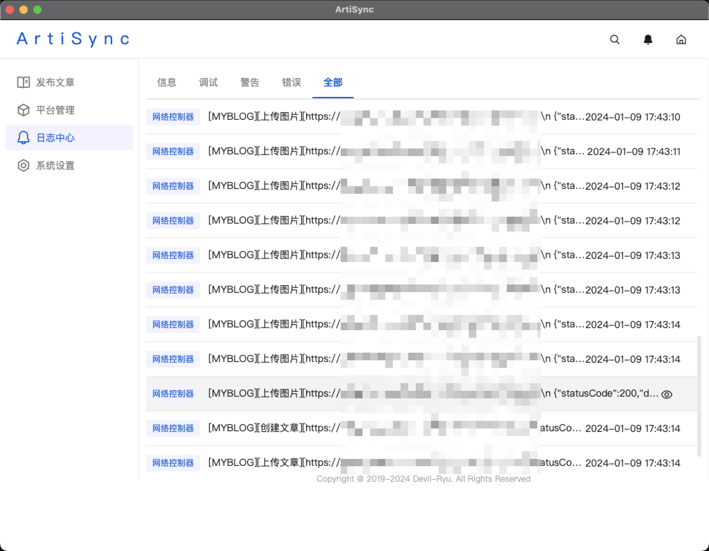

## 实践
#### 1 新增一个平台
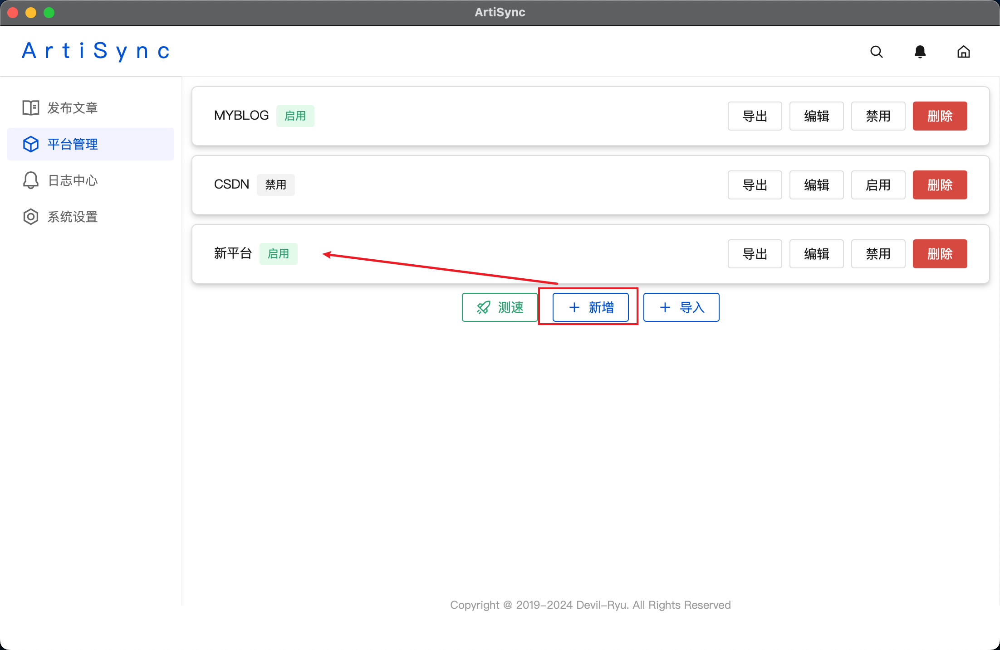
修改平台名称，向平台新增一个接口组，和一个接口  
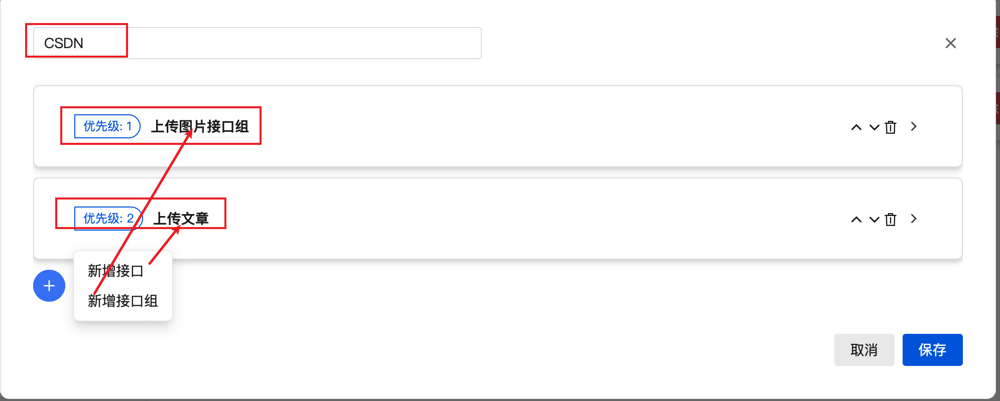
配置接口组内容，该接口组主要功能为上传图片，其需要用一个接口获取上传图片接口的预置信息，然后将这些信息填入第二个接口中进行上传。因此该组类型设置为`图片上传接口`，然后给接口组添加两个接口`获取图片接口预置信息`和`上传图片接口`，获取图片信息接口先运行，所以优先级设置为1，上传图片接口后运行，所以优先级设置为2  
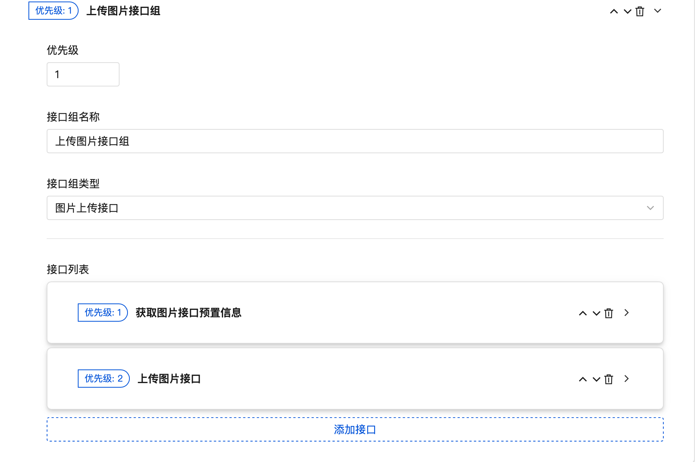
`获取图片接口预置信息`接口的请求配置，填入接口基本信息  
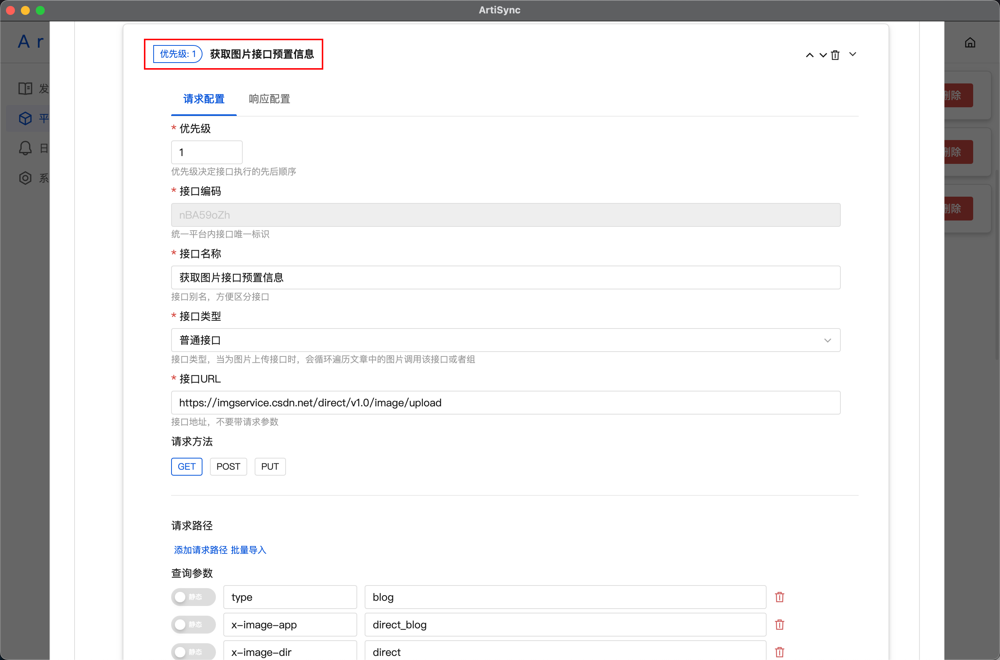
`获取图片接口预置信息`接口的响应配置，填入接口基本信息  
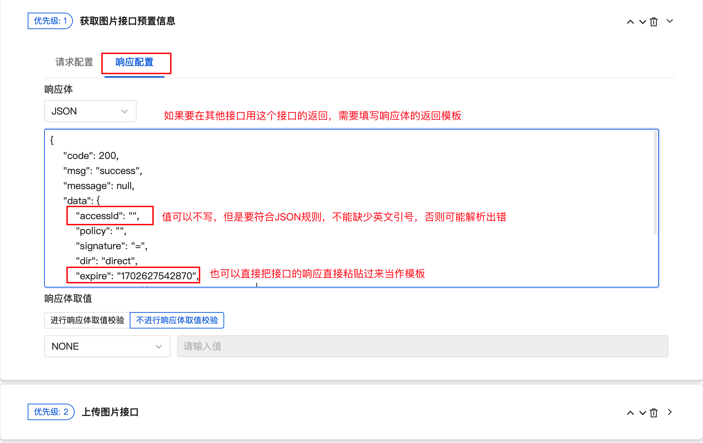
`上传图片接口`接口的请求配置，上传图片的接口，接口类型需要设置为`图片上传接口`  
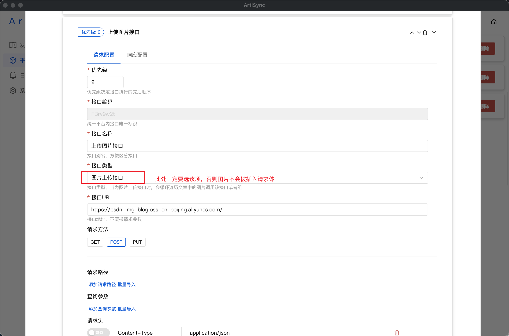
若该接口需要用到其他接口的返回值，可设置动态参数  

`上传图片接口`接口的响应配置，上传接口的响应需要取值出URL，因此需要填写取值规则  
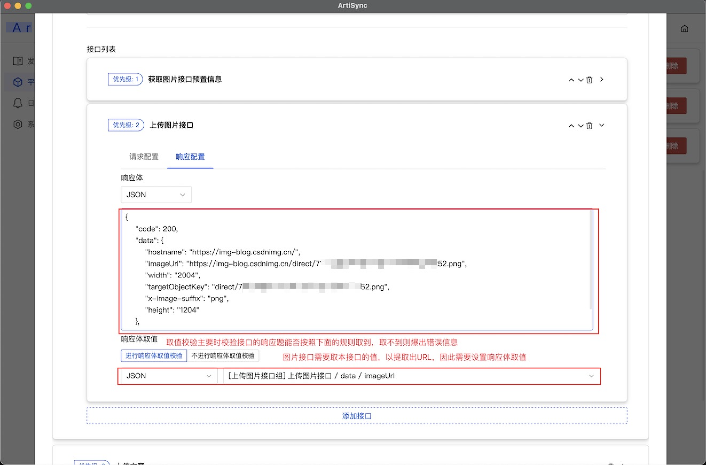
配置`上传文章`接口请求配置，接口类型可设置为`文章上传接口`，后续功能开发可能会用到  
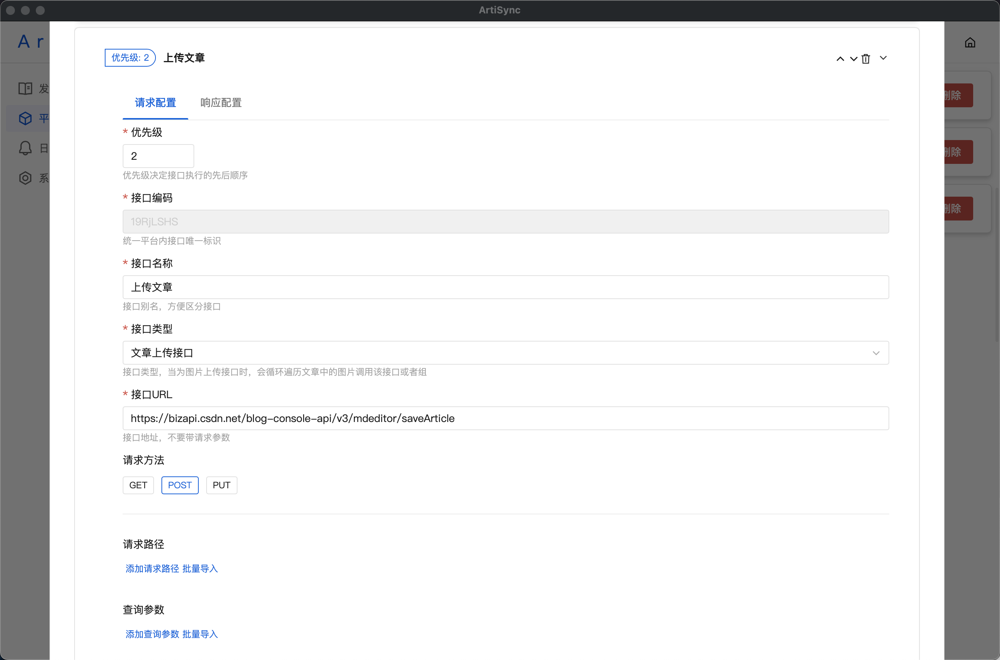
所有接口都可获取预置好的文章基本信息  
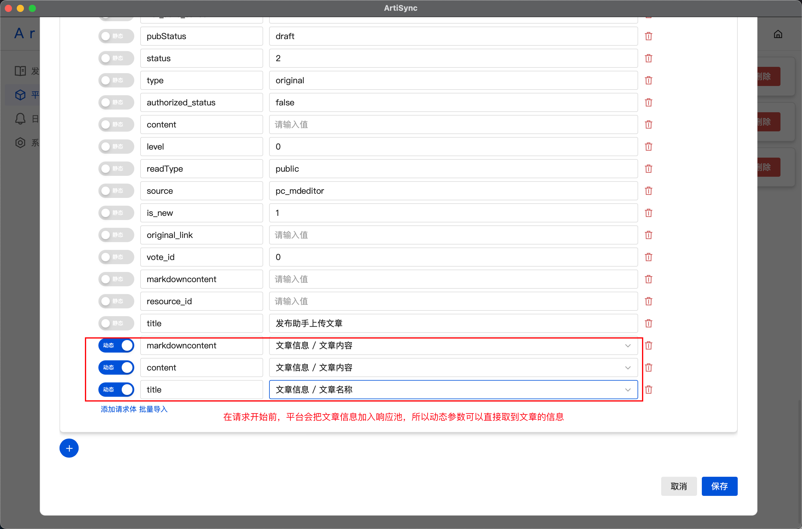
配置`上传文章`接口响应配置，不需要对响应做操作时，可都设置为NONE  
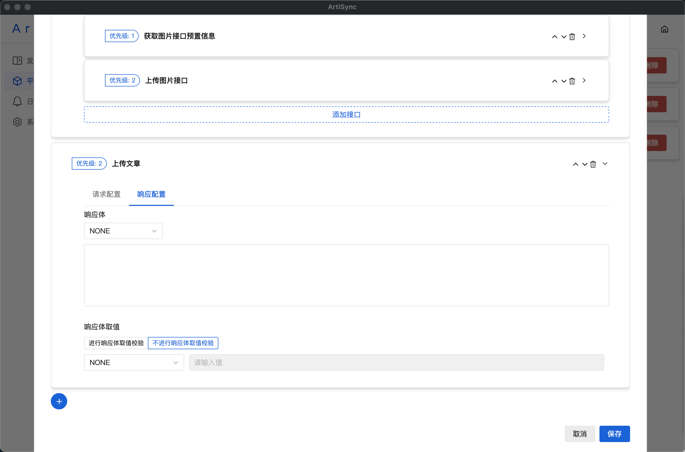
启用该平台，文章要上传到那个平台就启用那个平台，可以启用多个，则会上传至多个平台  
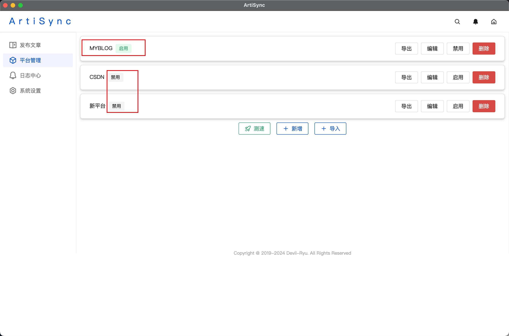
### 2 导入文章
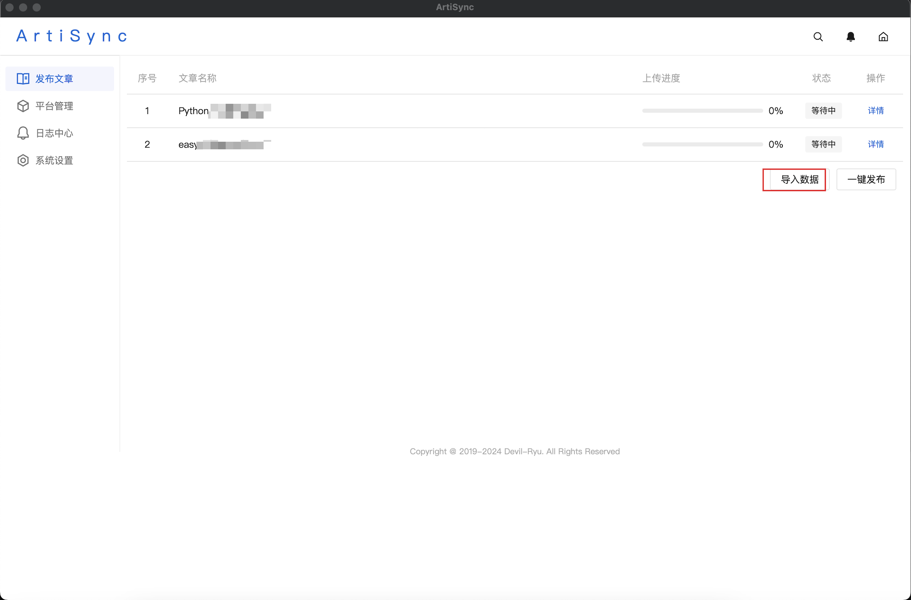
### 3 一键发布
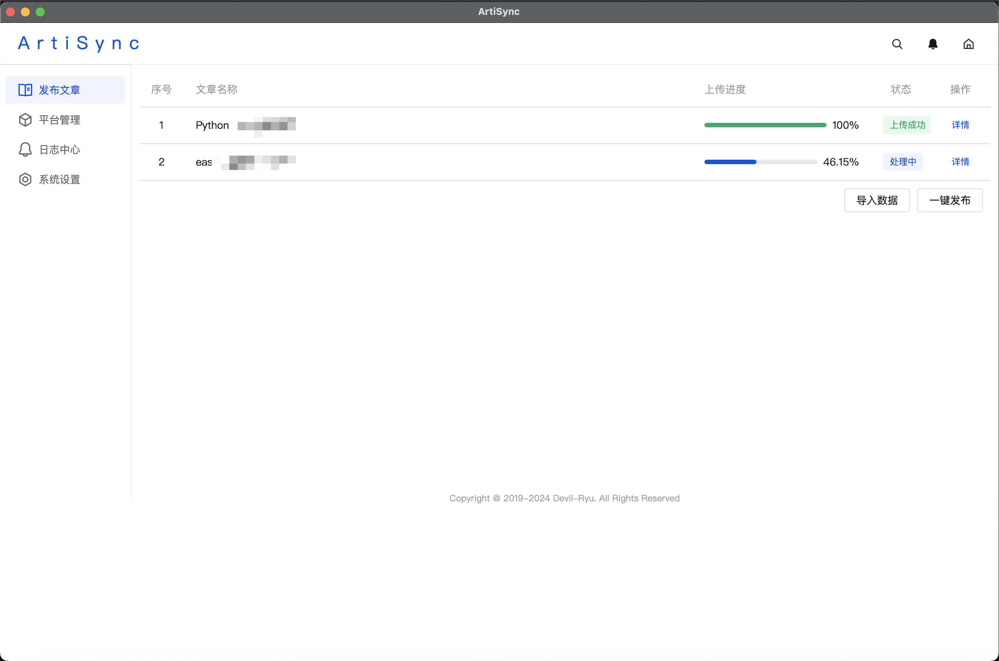