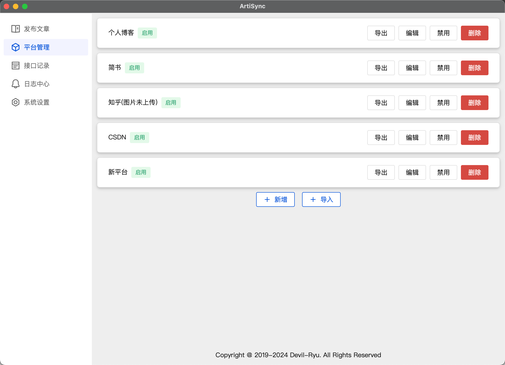

# 软件使用手册
## 1.发布文章
导入数据: 选择Markdown所在的文件夹，批量导入Markdown

一键发布: 批量将导入的Markdown文章按照启用的平台中的预设的接口进行发布


## 2.平台管理
### 2.1 新增平台
点击`新增`按钮，即可新增一个平台，点击平台卡片上的\`编辑\`即可编辑平台的基本信息

点击`导入` 按钮，即可导入一个预设好的平台




### 2.2 编辑平台
该功能为该软件的核心功能，它允许用户自定义接口，并将接口返回值存进缓存，以支持其他接口调用该接口的返回

常规的平台上传接口顺序为: 上传图片(优先级:1)，创建文章(优先级: 2)，上传文章(优先级: 3)

#### 2.2.1 编辑规则
编辑规则可批量对接口中的请求头和查询参数进行替换，设置规则以后点击保存，系统会对选择的借口，按照其位置查找对应的键，修改其值为设定的值，常用与设置平台Cookie，UserAgent等。（注意，此处替换的是接口中有多值，如果接口中没有该值需要先设置该值，否则不会替换），启用该规则后，对应接口到字段会显示为绿色，并且值变为不可编辑状态


#### 2.2.2 接口配置
新建接口：点击`+`按钮选择`新增接口`，即可新增接口，然后填写基本信息即可

新建接口组：点击`+`按钮选择`新增接口组`，即可新增接口组，接口组主要用于图片循环时，需要多个接口才能上传一个图片的情况，此时可新建接口组，接口组类型设置为图片上传接口，则系统会循环遍历接口组内的接口以依次上传图片。

接口参数: 分为`动态`和`静态`区别如下:

`静态`: 参数值不会改变

`动态`: 参数的值需要从缓存区取出，如：接口的返回，图片信息（遍历图片时程序自动存入缓存），文章信息（导入文章时程序自动存入缓存）

请求配置：

|名称|类型|说明|
| ----- | ----- | ----- |
|优先级|数值|优先级决定接口执行的先后顺序，值越小，越先执行|
|接口编码|字符串|每个平台内的接口唯一标识，随机生成，不可相同，不同平台的接口的编码可相同|
|接口名称|字符串|接口别名，方便查看|
|接口类型|字符串|可选项: `普通接口`/`图片上传接口`/`文章上传接口`；其中图片上传接口会遍历读取文章中的图片，然后重复调用该接口；若为接口组，则会每读取一张图片，执行一轮接口组内的接口（此时接口组内接口需要为普通接口），直至图片遍历完|
|接口URL|字符串|接口的URL地址，不需要带后面的路径，eg: https://www.test.com:9999|
|请求方法|字符串|可选项: `GET`/`POST`/`PUT`/`OPTIONS`/`PATCH`/`DELETE`/`HEAD`/`TRACE`/`CONNECT`|
|请求路径|字符串|URL后的具体路径，不用带`/` ，系统会自动拼接|
|查询参数|字符串|请求报文的查询参数，如`/?id=1`，设置为动态后可从其他接口的返回中选择|
|请求头|字符串|请求报文的请求头，如`UserAgent`等，设置为动态后可从其他接口的返回中选择|
|请求体|字符串|请求报文的请求体，`JSON`: 会把key和value合并成json数据，`JSONTEXT`：可读取JSON响应的返回，以TEXT的形式放到请求体，`ROWDATA`：会把key和value以key1=111&key2=222的形式拼接成数据，`FORMDATA`：用于上传表单数据，如图片，`NONE`： 不设置请求体设置为动态后可从其他接口的返回中选择|


响应配置：

|名称|类型|说明|
| ----- | ----- | ----- |
|响应体|字符串|请求的响应体模板，设置后，主要用于其他接口可调用该接口的响应参数，取值时候会看该类型，请根据报文类型，设置对应的类型。可选值NONE/JSON/TEXT/ROWDATA|
|响应体取值校验|布尔值|可选值：`进行校验`/`不进行校验` ，进行校验：会按照下方的校验规则对响应报文进行校验并取值（图片上传接口必须选择此项，并设置校验规则，否则无法取出图片链接），若校验不通过则接口记录中会返回运行失败；不进行校验：不对响应内容作校验|
|响应题校验规则|字符串|可选值：`NONE`/`JSON`/`RE` ，NONE：无校验规则，不进行校验；JSON：响应体为JSON，选择JSON的值，RE：对内容进行正则表达式校验并取值|


#### 2.2.3 运行记录
可查看该平台接口的运行记录，页面同接口记录


#### 2.2.4 测试缓存
此处主要查看测试时，测试网络模块的接口返回值。系统有两个网络模块，一个是`测试网络模块`，一个是`运行网络模块`，两个模块互相独立不干扰，当单独运行接口时使用的是测试网络模块，该模块所有平台共用，接口的返回也是所有平台共用。当点击一键发布时，运行的是运行网络模块，运行网络模块每个平台运行时会单独生成一个，因此缓存不共用。


## 3 接口记录
用于查看接口运行的记录


## 4 日志中心
用于查看系统运行时对日志


## 5 系统设置
### 5.1 文章设置
图片文件夹：用于定位文章到图片，系统会根据`文章所在文件夹`以及`图片在文章中的路径`进行拼接，相对文章目录（默认）： `文章所在文件夹` + `设定的目录` + `图片在文章中的路径` ,固定图片目录： `设定的目录` + `图片在文章中的路径` ，一般默认就行不用改，如果要改，导入几次文章看下日志中的报错就行。

```Plain Text
|--ArticleDir             # 文章所在文件夹
|    |--article.md        # markdown文章
|    |--images            # 图片文件夹
|        |--image1.jpg    # 图片文件(图片在文章中格式一般为)
```


### 5.2 系统设置
系统配置路径：软件运行时一些必要的基础信息会存放到该文件夹，建议不要删除。

数据库文件：数据库采用sqlite，可自定义数据库文件路径。

代理：如果需要代理可设置代理

接口请求速度限制：为防止接口请求速率过快，可设置每个接口运行后睡眠时间